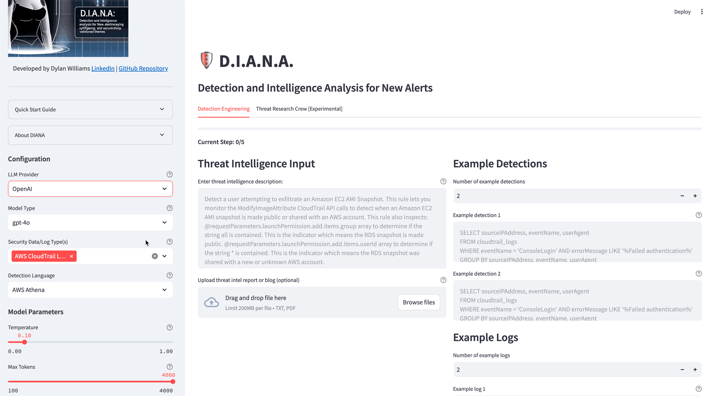

# DIANA: Detection and Intelligence Analysis for New Alerts

DIANA automates the creation of detections from threat intelligence using Large Language Models (LLMs).

Note: Providing high-quality example detections, logs, and your detection writing process is critical for optimal results.


*Select an LLM provider, security log source and detection language*

### If you liked the tool, head over to --> [seiber.ai](https://www.seiber.ai) to stay updated on what we're doing!

## Table of Contents

- [How To Use](#how-to-use)
- [Threat Research Agents](#threat-research-agents)
- [Features](#features)
- [Roadmap](#roadmap)
- [Installation](#installation)
- [Usage](#usage)
- [Configuration](#configuration)
- [Contributing](#contributing)
- [License](#license)

## How To Use

1. **Select LLM Provider and Model:**
   - Choose the LLM provider and model you want to use.
2. **Choose Security Data/Log Type(s):**
   - Focus on specific security data or log types.
3. **Select Detection Language:**
   - Choose your preferred detection language.
4. **Input Threat Information:**
   - Enter a website URL, write a description of threat TTP(s), or upload a document.
5. **Provide Example Detections:**
   - *Important:* Provide 3-7 diverse, high-quality example detections for the chosen log source.
6. **Provide Example Log Sources:**
   - *Important:* Provide 3-7 example log sources.
7. **Outline Detection Writing Steps:**
   - *Recommended:* Outline your typical detection writing steps to help DIANA follow your workflow.
8. **Describe Alert Triage/Investigation Steps:**
   - Describe steps for alert triage and investigation.
9. **Process Threat Intel:**
   - Click 'Process Threat Intel' to generate detection logic.

*Remember: The quality and diversity of your inputs directly impact DIANA's output. Take time to provide comprehensive examples and follow your standard workflow for the best results.*


*DIANA will convert the threat description into a detection, investigation steps and perform a QA check*

## Threat Research Agents


*Spin up a crew of autonomous agents to perform threat detection research*

This feature spins up a crew of autonomous AI agents that perform threat detection research on your topic of choice. They are maxed out at 5 iterations each, so no need to worry about them going rogue and taking over the world.
These agents use Exa, which employs semantic search (embeddings) to search the web, providing more contextually relevant results than traditional keyword-based search engines like Google.
        
**Examples of research topics:**
- Threat hunting in Okta logs
- Most common TTPs used by attackers in AWS
- Latest detection strategies for ransomware in Windows environments

## Features

- Automates the creation of detections from threat intelligence
- Supports models accessed via OpenAI API, Anthropic API, and other major LLM providers
- Converts threat intelligence from natural language descriptions, documents, or website URLs into high-quality detection logic, investigation steps, and response procedures
- Allows selection of LLM provider, security log source, and detection language to customize outputs
- Performs quality assurance checks on generated detection logic to ensure syntax accuracy
- Spin up a crew of AI agents for enhanced threat research (Crew AI, EXA AI, Firecrawl)
- Requires diverse, high-quality example detections and example log sources for optimal results
- Follows user-defined detection writing steps and workflows just like a new teammate would
- Generates comprehensive alert triage and investigation steps using Palantir's ADS framework
- Runs locally on the user's machine as a Streamlit app

## Roadmap

- [X] Multi-modal support (upload slides from your favorite cons or presentations, diagrams, images of incidents, TTPs)
- [X] Amazon Bedrock integration (data security and privacy)
- [ ] Docker container (host Diana yourself in your environment)
- [ ] Personalized prompts (when you're happy with your results, save your custom prompts so you don't have to keep copy/pasting example detections and logs)
- [ ] Auto prompt optimization (paste your examples and instructions and your prompt will be optimized for you to get the best possible results)
- [X] Metrics & Monitoring (view how much tokens you use and your cost $)
- [ ] RLHF (reinforcement learning from human feedback, thumbs up and down your answers to improve the quality of your results)
- [ ] Asynchronous/batch processing (convert 10 TTPs all at once in parallel)
- [ ] Customizable alerting & notification (send results to Slack, Google Chat or Jira ticket)
- [ ] Subscribe to a threat intel resource of choice (i.e. your favorite blog website or open-source detection content repo)
- [ ] Enhanced User Documentation and Tutorials: comprehensive user guides, video tutorials, and example use cases to help users get started and make the most out of Diana.
- [ ] Front End migration (TBD)
- [ ] Search & Tuning Agent (automatically search your SIEM/XDR/security data lake with your converted detection logic and correct for benign positives)
- [ ] Add RouteLLM to route prompts to ideal models to save cost, performance


## Installation

1. Clone the repository:
   ```
   git clone https://github.com/dwillowtree/diana.git
   cd diana
   ```
2. Create a virtual environment and activate it:
   ```
   python3.10 -m venv venv
   source venv/bin/activate  # On Windows use `venv\Scripts\activate`
   ```
3. Install the required dependencies:
   ```
   pip install -r requirements.txt
   pip install 'crewai[tools]' # you will need to manually install this library
   ```
4. Set up your environment variables:
   - Copy the `.env.example` file to `.env`
   - Edit the `.env` file and add your OpenAI, Anthropic, EXA AI and Firecrawl API keys

## Usage

To run the Streamlit app locally:
```
streamlit run app.py
```
Then, open your web browser and go to `http://localhost:8501`.  
PRO TIP: Use Claude 3 Haiku (fast, cheap and smart)

## Configuration

1. Obtain API keys:
   - For OpenAI: Visit https://platform.openai.com/account/api-keys
   - For Anthropic: Visit https://www.anthropic.com or follow their documentation
   - For EXA AI (this is only needed for the threat research agents): Visit https://exa.ai to obtain your API key. Exa searches the web based on the meaning
   of your search, as opposed to keyword search with Google. https://exa.ai/faq
   - For Firecrawl: Visit https://www.firecrawl.dev/ you can scrape 500 pages for free a month

2. Add your API keys to the `.env` file:
   ```
   OPENAI_API_KEY=your_openai_api_key_here
   ANTHROPIC_API_KEY=your_anthropic_api_key_here
   EXA_API_KEY=your_exa_api_key_here
   FIRECRAWL_API_KEY=your_firecrawl_api_key_here
   GROQ_API_KEY=your_groq_api_key_here
   AWS_ACCESS_KEY_ID=your_aws_access_key_id_here
   AWS_SECRET_ACCESS_KEY=your_aws_secret_access_key_here
   AWS_REGION_NAME=your_aws_region_name_here
   ```

## Contributing

1. Fork the repository
2. Create a new branch (`git checkout -b feature/your-feature-name`)
3. Make your changes
4. Commit your changes (`git commit -am 'Add some feature'`)
5. Push to the branch (`git push origin feature/your-feature-name`)
6. Create a new Pull Request

Please ensure that your code follows the existing style and includes appropriate tests and documentation.

**If you have any feedback on the tool, or just want to talk AI or security shoot an email to dwilliams@seiber.ai.**

## License

This project is licensed under the MIT License - see the [LICENSE](LICENSE) file for details.